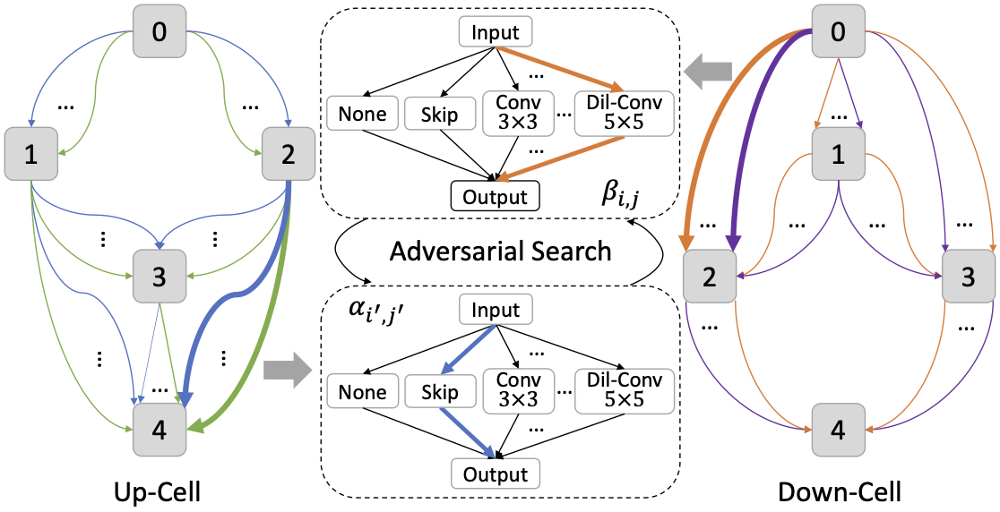
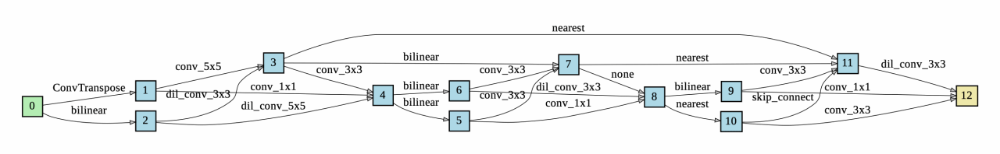
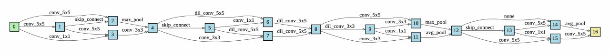

# AdversarialNAS-GAN
Code for our CVPR 2020 paper "[AdversarialNAS: Adversarial Neural Architecture Search for GANs](https://arxiv.org/pdf/1912.02037.pdf)".

Contributed by Chen Gao, [Yunpeng Chen](https://cypw.github.io/), [Si Liu](https://scholar.google.com/citations?user=bqV8WoIAAAAJ&hl=zh-CN), Zhenxiong Tan, [Shuicheng Yan](https://scholar.google.com/citations?user=DNuiPHwAAAAJ&hl=zh-CN).

## Introduction
We propose a novel **AdversarialNAS** method, which is the **first gradient-based fully differentiable NAS method in GAN field** and achieves state-of-art performance with much higher efficiency. We also design a large architecture search space for GAN and make it feasible to search in.

## Architecture search snapshots

## Checklist
- [x] Searched architecture of generative model on CIFAR-10 dataset.
- [x] Re-trained generative models on CIFAR-10 and STL-10.
- [x] Inference codes for evaluation.
- [x] Training codes for the searched architectures.
- [ ] Searching codes.

## Getting Started
### Installation
1. Clone this repository.

    ~~~
    git clone https://github.com/chengaopro/AdversarialNAS.git
    ~~~
   
2. Install pytorch 1.1.0, tensorflow 1.9.0, CUDA 9.0 and corresponding CUDNN via conda.

    ~~~
    conda install pytorch==1.1.0 torchvision==0.3.0 cudatoolkit=9.0 -c pytorch
    ~~~
   
    ~~~
    conda install tensorflow-gpu==1.9.0 cudnn
    ~~~
   
3. Install the requirements via pip.
    
    ~~~
    pip install -r requirements.txt
    ~~~

### Preparing necessary files

Files can be found in [Google Drive](https://drive.google.com/drive/folders/17Kqc5aImZ2vHJ1SH1HkrHjlk0MZeuM6q?usp=sharing) and [Baidu Drive (passcode: bk1m)](https://pan.baidu.com/s/1_1K6mqKxGj3_TBbJcSUE-Q).
1. Download the two trained generative models to ./exps/arch_train_cifar10/Model and ./exps/arch_train_stl10/Model respectively.

    ~~~
    mkdir -p exps/arch_train_cifar10/Model exps/arch_train_stl10/Model 
    ~~~
   
2. Download the pre-calculated statistics to ./fid_stat for calculating the FID.
    
    ~~~
    mkdir fid_stat
    ~~~
   
3. Download the inception model to ./tmp for calculating the IS and FID.
    
    ~~~
    mkdir tmp
    ~~~
   
## Search
Coming soon.
## Train and Test the searched architecture.
### Training
1. Train the weights of generative model with the searched architecture (the architecture is saved in ./exps/arch_cifar10/Genotypes/latest_G.npy)
    
    ~~~
    sh scripts/train_arch_cifar10.sh
    ~~~
    or
    ~~~
    sh scripts/train_arch_stl10.sh
    ~~~
   
### Testing
2. Test the trained model
    ~~~
    sh scripts/test_arch_cifar10.sh
    ~~~
    or
    ~~~
    sh scripts/test_arch_stl10.sh
    ~~~

## Citation
Please consider citing our paper in your publications if it helps your research. The following is a BibTeX reference. The BibTeX entry requires the url LaTeX package.

~~~
@InProceedings{Gao_2020_CVPR,
author = {Gao, Chen and Chen, Yunpeng and Liu, Si and Tan, Zhenxiong and Yan, Shuicheng},
title = {AdversarialNAS: Adversarial Neural Architecture Search for GANs},
booktitle = {The IEEE/CVF Conference on Computer Vision and Pattern Recognition (CVPR)},
month = {June},
year = {2020}
}
~~~

## License
AdversarialNAS is released under the MIT license. See [LICENSE](LICENSE) for additional details.
## Acknowledge
Some of the codes are built upon [improved-gan](https://github.com/openai/improved-gan), [AutoGAN](https://github.com/TAMU-VITA/AutoGAN) and [DARTS](https://github.com/quark0/darts). Thanks them for their great works!
